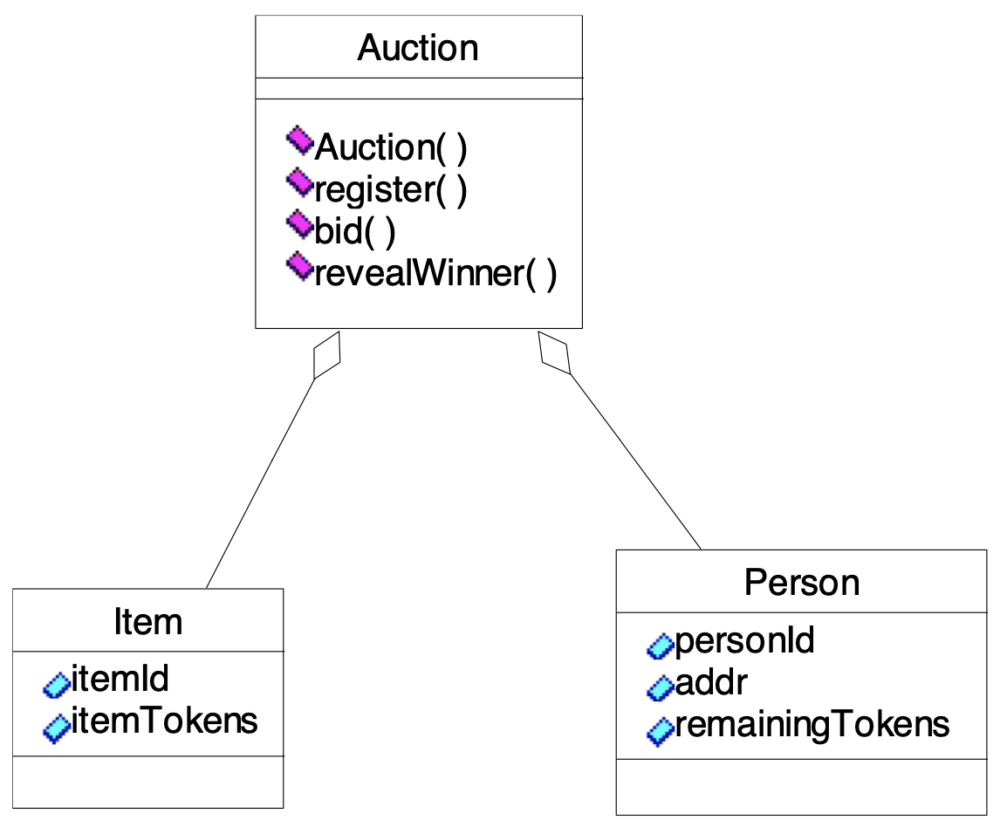

# smart-contract-auction
## Smart Contract for Auction for Fund Raising

### Problem Statement:
Items to be auctioned are arranged on a table and a bowl kept in front of each.
chairperson is a special person who heads the effort is the only person who can determine the winner by random drawing at the end of the auction. A set of bidders buy sheets of tickets with their money. The bidder’s sheet has a stub that identifies the bidder’s number, and tokens bought.

The bidders examine the items to bid, place the one or more tickets in the bowl in front of the items they desire to bid for until all the tickets are used. After the auction period ends the chairperson, collects the bowls, randomly selects a ticket from each item’s bowl to determine the winning bidder for that item. The item is transferred to the winning bidder.

### Assumptions:
<ol>
<ul>Fixed number of bidders, initialized to 4. All 4 need to self-register. Funds transfer from bidder is automatically done and is not in the scope of this application.</ul>
<ul>Fixed number of items to be auctioned off, initialized to 3.</ul>
<ul>Items auctioned are indexed from 0..N-1 where N is the number of items for auction. N is 2.</ul>
<ul>Each bidder buys just 1 sheet of tickets or tokens; each sheet has only 5 tokens.</ul>
<ul>Assume simple number for the serial numbers for the sheet of tickets: 0,1,2,3</ul>
</ol>

### Design

